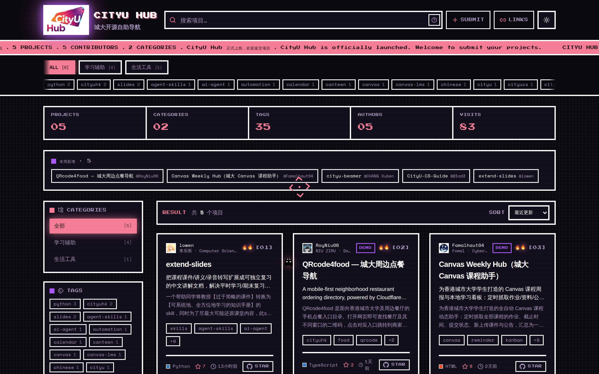

<div align="center">


# CityU Hub

**香港城大开源自助导航 · 香港城市大學學生項目和開源自助檢索平台 · Discover what CityU students are building**

**[简体中文](#简体中文) · [繁體中文](#繁體中文) · [English](#english)**

[](https://github.com/Warpshlczy/CityU-Hub/actions/workflows/ci.yml)
[](https://github.com/Warpshlczy/CityU-Hub/actions/workflows/deploy.yml)
[](https://github.com/Warpshlczy/CityU-Hub/stargazers)
[](LICENSE)
[](CONTRIBUTING.md)

[](https://react.dev) [](https://www.typescriptlang.org) [](https://vite.dev) [](https://tailwindcss.com) [](https://reactrouter.com) [](https://lucide.dev)

[](https://nodejs.org) [](https://marked.js.org) [](https://ajv.js.org) [](https://github.com/nodeca/js-yaml) [](https://github.com/Warpshlczy/CityU-Hub/actions)

</div>

<div align="center">

<!-- screenshot:start -->


<sub>截图时间 / 截圖時間 / captured at: 2026-09-24 16:23 (UTC+8) · 截图者 / 截圖者 / by: @github-actions[bot]</sub>

**站点一览 · Homepage at a glance**
<!-- screenshot:end -->

<a href="https://cityu-hub.bond">
  
</a>

</div>
<br />
<div align="center">

<!-- contributors:start -->
<table border="1" cellspacing="0" cellpadding="14" align="center">
<tr><td align="center"><a href="https://github.com/Warpshlczy" title="Warpshlczy"></a>&nbsp; <a href="https://github.com/L01nki1" title="L01nki1"></a>&nbsp; <a href="https://github.com/Famalhaut04" title="Famalhaut04"></a>&nbsp; <a href="https://github.com/RoyNiu06" title="RoyNiu06"></a>&nbsp; <a href="https://github.com/null1024-ws" title="null1024-ws"></a></td></tr>
</table>
✨Thank you all for your contributions to this repository✨
<!-- contributors:end -->

</div>

---

## 简体中文

### 这是什么

CityU Hub 是一个面向**香港城市大学（CityU）学生开源项目**的展示与检索网站。同学们把自己写的小工具、课程项目、科研代码提交进来，其他人在一个页面里就能按**分类 / 标签 / 语言 / 作者**筛选，搜索并直接跳到 GitHub 仓库。

我们建站的初衷：

- **散**：校内项目散落在聊天群、课程群和各人主页里，没有统一入口。
- **找不到**：想找「有没有人做过 NLP 相关的东西」时，没有任何可检索的索引。
- **认不出作者**：看得到仓库，却不知道是哪个专业、哪一届的同学。

### 网站内容与功能

| 功能 | 说明 |
| --- | --- |
| 项目浏览 | 卡片流展示项目名、摘要、标签、语言色块、Star 数与最近更新时间 |
| 搜索语法 | `author:alice`、`tag:NLP`、`lang:Python`、`category:机器学习`，可叠加 `author:alice lang:Python`；不带冒号的词走全文模糊匹配 |
| 筛选与排序 | 分类页签、标签 chips、作者榜一键筛选；支持按最近更新 / Star / 名称排序 |
| 项目详情 | 渲染仓库 README、作者实名与专业年级、Demo 与 GitHub 外链 |
| 可分享链接 | 搜索词、筛选、分类、排序、主题全部同步到 URL，刷新/分享后状态不丢 |
| 常用入口 | 右上角 🔗 抽屉内置 AIMS / Canvas / 学校官网 / CityUHK Portal |

### 技术栈

**前端**：React 19 · TypeScript 5.9 · Vite 6 · Tailwind CSS v4（CSS-first）· React Router 7（HashRouter）· lucide-react
**解析器**：Node.js ≥ 20.6 · marked（Markdown → HTML）· ajv（JSON Schema 校验）· js-yaml（front matter 解析）

### 项目结构

```text
CityU-Hub/
├── repos/                      # 项目条目：每个项目一个 Markdown（front matter + 正文）
│   ├── _template.md            # 提交模板，复制它开始写自己的项目
│   ├── CityU-Beamer.md
│   └── extend-slides.md
├── schema/
│   └── repo.schema.json        # front matter 的 JSON Schema，CI 用它把关
├── repos-parser/               # 解析器：repos/*.md → web/public/data/*.json
│   ├── src/build-index.mjs     # 生成列表、聚合与项目详情（含渲染好的 README HTML）
│   ├── src/validate-repos.mjs  # 按 schema 校验、项目 ID / 仓库地址查重
│   └── src/lib/                # front matter、Markdown、GitHub、聚合等纯函数
├── web/                        # 前端站点（一条 npm 命令完成解析 + 打包）
│   ├── public/data/            # 解析产物，已 gitignore，每次构建重新生成
│   └── src/
│       ├── api/                # 读静态 JSON，并在运行时用 GitHub 补齐缺失字段
│       ├── components/         # 卡片、搜索栏、侧栏、筛选与排序等
│       ├── hooks/              # useProjects、useSearch、useUrlState
│       ├── pages/              # 首页、项目详情页
│       └── utils/              # 搜索语法解析、格式化、slug
├── api/                        # Vercel 函数：track（埋点）/ stats（读聚合）
├── lib/                        # 函数与脚本共用的工具（Upstash REST 客户端）
├── scripts/
│   ├── prerender.mjs           # 构建后产出静态页、sitemap.xml、robots.txt 与徽章 SVG
│   ├── sync-and-build.sh       # 目标机器拉取最新代码并重建站点
│   └── update-contributors.mjs # 刷新贡献者面板（头像墙 + 名单）
├── tests/                      # 用内存版 Redis 直接跑 /api 函数的测试
└── .github/workflows/          # ci（校验+构建）/ deploy（自托管重建）/ feature-to-main（项目 PR 合入后同步 main）/ main-sync（刷新贡献者名单 + 同步 feature）
```

`repos-parser` 与 `web` 通过根目录的 **npm workspaces** 串起来，`npm install` 一次装好两边依赖。

### 数据流

```text
repos/*.md ─► npm run validate ─► repos-parser ─► web/public/data/*.json ─► vite build ─► web/dist
                                                      ▲
                                    GitHub API 补 stars / 语言 / 头像（可选）
```

解析器直接产出前端契约的 JSON，没有中间接口层：

- `data/projects.json`：项目列表 + 标签 / 作者 / 分类聚合
- `data/projects/<id>.json`：单个项目详情，`readmeHtml` 已渲染好，前端直接插入

`npm run build` 离线解析，产物完全可复现；`npm run build:online` 会额外调用 GitHub API 补齐 stars、语言与仓库 About（需要 `GITHUB_TOKEN`，见 `repos-parser/.env.example`）。**线上 Vercel 构建用的就是 `build:online`**，请在 Vercel 项目的环境变量里配 `GITHUB_TOKEN`；没配或 token 失效时构建不会失败，但这三项会留空，由前端运行时补（头像不依赖接口，直接用 `github.com/<用户名>.png`）。

打包完成后 `scripts/prerender.mjs` 还会为每个路由生成一份带 Meta 与 JSON-LD 的静态 HTML，并产出 `sitemap.xml`、`robots.txt` 与 `badge/<id>.svg` 徽章 —— 搜索引擎拿到的就是渲染好的内容，不依赖 JS。

站内统计（全站 UV、卡片浏览与外链点击）走 `api/track` 与 `api/stats` 两个函数，数据放在 Upstash Redis，前端据此计算卡片热力值。在 Vercel 环境变量里配 `KV_REST_API_URL` / `KV_REST_API_TOKEN`（Upstash 集成默认注入这两个名字，也兼容 `UPSTASH_REDIS_REST_URL` / `UPSTASH_REDIS_REST_TOKEN`）。**没配时埋点静默失效**，页面照常渲染，热力值只按 GitHub 数据计算。

网站上的「我也要提交项目」表单采用 **fork 引导** 流程：填好字段提交前，前端会按你填写的 GitHub 用户名查一次公开 API，确认你是否已 fork 本站仓库并拉好 `feature` 分支（登录态无法在静态前端确认，这里以表单里填的用户名为准）。未 fork 时前端会给出指引（Fork 本站 → 切到 `feature` → 回到页面重新检测），检测通过后把预填内容带到你 fork 的 `feature` 分支新建文件，提交即开 PR 回本站。站内不再持有写端 token，也没有「本站代开 PR」的接口。

### 本地运行

```bash
npm install     # 根目录一次装好 repos-parser 与 web 的依赖
npm run dev     # 先解析 repos/*.md，再启动 http://localhost:5173
```

常用命令：

```bash
npm run build        # 解析 + 类型检查 + 打包，产物在 web/dist
npm run build:online # 同上，但联网补齐 stars / 语言 / 头像
npm run preview      # 本地预览构建产物
npm run validate     # 校验 repos/*.md 的 front matter、Schema 与重复项
npm test             # 解析器与 /api 函数测试
```

### 一键入口

不想翻文档就直接点，表格里的徽章已经带好标签与目标分支：

| 想做的事 | 一键唤起 | 说明 |
| --- | --- | --- |
| 提交自己的项目 | [](https://github.com/Warpshlczy/CityU-Hub/new/feature?filename=repos/my-project.md) | 打开 GitHub 文件编辑器，没权限会自动 fork，文件建在 `feature` 分支，提交即开 PR |
| 报告 Bug | [](https://github.com/Warpshlczy/CityU-Hub/issues/new?labels=bug&title=%5BBug%5D%20) | 已预填标题 `[Bug]` 与 `bug` 标签 |
| 提功能建议 / 提问 | [](https://github.com/Warpshlczy/CityU-Hub/issues/new?labels=enhancement&title=%5BFeature%5D%20) | 已预填标题 `[Feature]` 与 `enhancement` 标签 |
| 看别人提了什么 | [浏览全部 Issue](https://github.com/Warpshlczy/CityU-Hub/issues) | 先搜一下，避免重复 |

### 分支模型

仓库只有三条长期分支，默认分支是 `main`；旧分支 `master` 已删除，请统一用 `main`：

| 分支 | 用途 | 收哪类 PR |
| --- | --- | --- |
| `main` | 稳定发布分支，线上的正式版本以它为准 | 只接受 `feature` / `dev` 的合并，不直接往上提交 |
| `feature` | 只丢 Markdown 文件：`repos/*.md` | 项目作者的「提交我的项目」PR |
| `dev` | 网站改动与新功能：`web/`、`repos-parser/`、`scripts/`、工作流、文档 | 前端 / 解析器 / 文档类 PR |

```text
项目提交 PR ─► feature ─┐
                        ├─► main ─► 正式发布（自建机器重建）
网站改动 PR ─► dev ─────┘
```

- **提项目**：从 `feature` 切分支（例如 `feat/add-my-project`），PR 的目标分支选 **`feature`**。
- **改网站**：从 `dev` 切分支（例如 `feat/search-syntax`），PR 的目标分支选 **`dev`**。
- `feature` 上的项目 PR 合并后，由 [`feature-to-main.yml`](.github/workflows/feature-to-main.yml) 自动合入 `main`；`dev` 由维护者定期合并回 `main`。**只有合并到 `main` 才会触发正式发布**。
- `main` 每次推送后由 [`main-sync.yml`](.github/workflows/main-sync.yml) 自动同步回 `feature`，并刷新下面的贡献者名单。
- PR 一打开就会跑 CI（校验 front matter、单元测试、整站构建），与目标分支无关。

### 成为贡献者

**非常欢迎你参与 CityU Hub！** 无论你是想把自己的项目放上来、修一个前端小 bug、补一段文档，还是只提一个想法，都是这个项目需要的贡献。

#### 方式一：提交你的项目（最主要）

1. **Fork** 本仓库并 clone 到本地，从 `feature` 建一个分支，例如 `feat/add-my-project`。也可以直接点上面的[一键新建项目文件](https://github.com/Warpshlczy/CityU-Hub/new/feature?filename=repos/my-project.md)在网页上填。
2. 复制 `repos/_template.md` 为 `repos/你的项目名.md`，填写 front matter 与正文。
3. 必填字段：`title`、`author`（GitHub 用户名）、`authorName`（真实姓名）、`major`（专业）、`enrollmentYear`（入学年份，四位数字）、`repoUrl`（必须是公开的 `https://github.com/...` 地址）。可选：`id`、`summary`、`homepageUrl`、`tags`（最多 12 个小写短标签）、`category`、`featured`、`status`（`active` / `hidden` / `archived`）。**schema 不允许出现未定义的字段。**
4. 正文写在 front matter 之后：开头写项目介绍，`## Features` 段落完全由作者自行决定——写了才展示，**留空或整段不写都不会出现 Features**，也不会用 GitHub 仓库简介去补齐。想让项目页直接展示仓库 README，把项目介绍留空即可。
5. 本地自检（务必先跑通）：
   ```bash
   npm install
   npm run validate   # front matter 是否符合 schema、ID 与仓库地址是否重复
   npm test           # 解析器与 /api 函数测试
   npm run build      # 确认能正常解析并构建出站点
   ```
6. 提交 Pull Request 到 `feature` 分支。CI 会自动跑 `validate`、测试与整站构建；通过后由维护者 review 合并。合并进 `main` 后托管平台会自动重新构建发布，站点随即更新。

> 目录、字段名、枚举值的完整约定见 [`CONTRIBUTING.md`](CONTRIBUTING.md) 与 [`schema/repo.schema.json`](schema/repo.schema.json)。

#### 方式二：改进网站本身

前端 / 解析器 / 工作流的 PR 同样欢迎，请把 PR 提到 **`dev`** 分支。动手前请先开一个 issue 说清楚你想做什么，避免重复劳动；提交前请确认：

```bash
npm test        # 测试（解析器 + /api 函数）必须通过
npm run build   # 类型检查 + 打包必须通过
```

#### 方式三：文档、翻译与反馈

发现错别字、想补英文翻译、有更好的界面建议，都可以直接开 issue 或提 PR——这类贡献和代码同等重要。

**期待在贡献者名单里看到你。**

### 许可证

本项目基于 [MIT License](LICENSE) 开源，版权归 **CityU Hub contributors** 所有。

你可以自由使用、复制、修改、合并、发布、分发、再授权及/或销售本软件的副本，只需在副本或实质性部分中保留上述版权声明与许可声明。本软件按「原样」提供，不附带任何形式的明示或默示担保。

这意味着：**你提交到 `repos/` 的项目条目仍然归你所有**，MIT 只覆盖 CityU Hub 自身的站点与解析器代码。

### 联系我们

想投稿项目、反馈问题、提建议，或者只是想聊聊？欢迎随时发邮件，我们都会看：

[](mailto:contact.cityu-hub@proton.me)

---

## 繁體中文

### 這是什麼

CityU Hub 是一個面向**香港城市大學（CityU）學生開源項目**的展示與檢索網站。同學們把自己寫的小工具、課程項目、研究程式碼提交進來，其他人在同一個頁面就能按**分類 / 標籤 / 語言 / 作者**篩選，搜尋並直接跳到 GitHub 儲存庫。

網站解決的三個問題：

- **散**：校內項目散落在聊天群組、課程群組和個人主頁裡，沒有統一入口。
- **找不到**：想找「有沒有人做過 NLP 相關的東西」時，沒有任何可檢索的索引。
- **認不出作者**：看得到儲存庫，卻不知道是哪個主修、哪一屆的同學。

### 網站內容與功能

| 功能 | 說明 |
| --- | --- |
| 項目瀏覽 | 卡片流展示項目名、摘要、標籤、語言色塊、Star 數與最近更新時間 |
| 搜尋語法 | `author:alice`、`tag:NLP`、`lang:Python`、`category:機器學習`，可疊加 `author:alice lang:Python`；不帶冒號的字詞走全文模糊搜尋 |
| 篩選與排序 | 分類頁籤、標籤 chips、作者榜一鍵篩選；支援按最近更新 / Star / 名稱排序 |
| 項目詳情 | 渲染儲存庫 README、作者真實姓名與主修年級、Demo 與 GitHub 外部連結 |
| 可分享連結 | 搜尋詞、篩選、分類、排序、主題全部同步到 URL，重新整理或分享後狀態不丟 |
| 主題 | 亮 / 暗雙主題切換，首屏前注入、無閃爍 |
| 常用入口 | 右上角 🔗 抽屜內建 AIMS / Canvas / 學校官網 / CityUHK Portal |

### 技術棧

**前端**：React 19 · TypeScript 5.9 · Vite 6 · Tailwind CSS v4（CSS-first）· React Router 7（HashRouter）· lucide-react
**解析器**：Node.js ≥ 20.6 · marked（Markdown → HTML）· ajv（JSON Schema 驗證）· js-yaml（front matter 解析）

### 項目結構

```text
CityU-Hub/
├── repos/                      # 項目條目：每個項目一個 Markdown（front matter + 正文）
│   ├── _template.md            # 提交模板，複製它開始寫自己的項目
│   ├── CityU-Beamer.md
│   └── extend-slides.md
├── schema/
│   └── repo.schema.json        # front matter 的 JSON Schema，CI 用它把關
├── repos-parser/               # 解析器：repos/*.md → web/public/data/*.json
│   ├── src/build-index.mjs     # 產生列表、聚合與項目詳情（含渲染好的 README HTML）
│   ├── src/validate-repos.mjs  # 按 schema 驗證、項目 ID / 儲存庫網址檢查重複
│   └── src/lib/                # front matter、Markdown、GitHub、聚合等純函式
├── web/                        # 前端網站（一條 npm 指令完成解析 + 打包）
│   ├── public/data/            # 解析產物，已 gitignore，每次建構重新產生
│   └── src/
│       ├── api/                # 讀靜態 JSON，並在執行時用 GitHub 補齊缺失欄位
│       ├── components/         # 卡片、搜尋列、側欄、篩選與排序等
│       ├── hooks/              # useProjects、useSearch、useUrlState
│       ├── pages/              # 首頁、項目詳情頁
│       └── utils/              # 搜尋語法解析、格式化、slug
├── api/                        # Vercel 函式：track（埋點）/ stats（讀聚合）
├── lib/                        # 函式與腳本共用的工具（Upstash REST 客戶端）
├── scripts/
│   ├── prerender.mjs           # 建構後產出靜態頁、sitemap.xml、robots.txt 與徽章 SVG
│   ├── sync-and-build.sh       # 目標機器拉取最新程式碼並重建網站
│   └── update-contributors.mjs # 刷新貢獻者面板（頭像牆 + 名單）
├── tests/                      # 用記憶體版 Redis 直接跑 /api 函式的測試
└── .github/workflows/          # ci（驗證+建構）/ deploy（自架重建）/ feature-to-main（項目 PR 合入後同步 main）/ main-sync（刷新貢獻者名單 + 同步 feature）
```

`repos-parser` 與 `web` 透過根目錄的 **npm workspaces** 串起來，`npm install` 一次裝好兩邊依賴。

### 資料流

```text
repos/*.md ─► npm run validate ─► repos-parser ─► web/public/data/*.json ─► vite build ─► web/dist
                                                      ▲
                                    GitHub API 補 stars / 語言 / 頭像（可選）
```

解析器直接產出前端契約的 JSON，沒有中間介面層：

- `data/projects.json`：項目列表 + 標籤 / 作者 / 分類聚合
- `data/projects/<id>.json`：單個項目詳情，`readmeHtml` 已渲染好，前端直接插入

`npm run build` 離線解析，產物完全可重現；`npm run build:online` 會額外呼叫 GitHub API 補齊 stars、語言與倉庫 About（需要 `GITHUB_TOKEN`，見 `repos-parser/.env.example`）。**線上 Vercel 建構用的就是 `build:online`**，請在 Vercel 專案的環境變數裡設定 `GITHUB_TOKEN`；未設定或 token 失效時建構不會失敗，但這三項會留空，由前端執行時補（頭像不依賴 API，直接用 `github.com/<使用者名稱>.png`）。

打包完成後 `scripts/prerender.mjs` 還會為每個路由產生一份帶 Meta 與 JSON-LD 的靜態 HTML，並產出 `sitemap.xml`、`robots.txt` 與 `badge/<id>.svg` 徽章 —— 搜尋引擎拿到的是已渲染的內容，不依賴 JS。

站內統計（全站 UV、卡片瀏覽與外連點擊）走 `api/track` 與 `api/stats` 兩個函式，資料放在 Upstash Redis，前端據此計算卡片熱力值。在 Vercel 環境變數裡設定 `KV_REST_API_URL` / `KV_REST_API_TOKEN`（Upstash 整合預設注入這兩個名字，也相容 `UPSTASH_REDIS_REST_URL` / `UPSTASH_REDIS_REST_TOKEN`）。**未設定時埋點靜默失效**，頁面照常渲染，熱力值只按 GitHub 資料計算。

網站上的「我也要提交項目」表單採用 **fork 引導** 流程：填好欄位提交前，前端會依你填寫的 GitHub 使用者名稱查一次公開 API，確認你是否已 fork 本站倉庫並拉好 `feature` 分支（登入態無法在靜態前端確認，以表單內填的名字為準）。未 fork 時前端會給出指引（Fork 本站 → 切到 `feature` → 回到頁面重新偵測），偵測通過後把預填內容帶到你 fork 的 `feature` 分支新建檔案，提交即開 PR 回本站。站內不再持有寫端 token，也沒有「本站代開 PR」的介面。

### 本機執行

```bash
npm install     # 根目錄一次裝好 repos-parser 與 web 的依賴
npm run dev     # 先解析 repos/*.md，再啟動 http://localhost:5173
```

常用指令：

```bash
npm run build        # 解析 + 型別檢查 + 打包，產物在 web/dist
npm run build:online # 同上，但連網補齊 stars / 語言 / 頭像
npm run preview      # 本機預覽建構產物
npm run validate     # 驗證 repos/*.md 的 front matter、Schema 與重複項
npm test             # 解析器與 /api 函式測試
```

### 一鍵入口

不想翻文件就直接點，表格裡的徽章已帶好標籤與目標分支：

| 想做的事 | 一鍵喚起 | 說明 |
| --- | --- | --- |
| 提交自己的項目 | [](https://github.com/Warpshlczy/CityU-Hub/new/feature?filename=repos/my-project.md) | 打開 GitHub 檔案編輯器，沒權限會自動 fork，檔案建在 `feature` 分支，提交即開 PR |
| 報告 Bug | [](https://github.com/Warpshlczy/CityU-Hub/issues/new?labels=bug&title=%5BBug%5D%20) | 已預填標題 `[Bug]` 與 `bug` 標籤 |
| 提功能建議 / 提問 | [](https://github.com/Warpshlczy/CityU-Hub/issues/new?labels=enhancement&title=%5BFeature%5D%20) | 已預填標題 `[Feature]` 與 `enhancement` 標籤 |
| 看別人提了什麼 | [瀏覽全部 Issue](https://github.com/Warpshlczy/CityU-Hub/issues) | 先搜一下，避免重複 |

### 分支模型

倉庫只有三條長期分支，預設分支是 `main`；舊分支 `master` 已刪除，請統一使用 `main`：

| 分支 | 用途 | 收哪類 PR |
| --- | --- | --- |
| `main` | 穩定發佈分支，線上的正式版本以它為準 | 只接受 `feature` / `dev` 的合併，不直接往上提交 |
| `feature` | 只丟 Markdown 文件：`repos/*.md` | 項目作者的「提交我的項目」PR |
| `dev` | 網站改動與新功能：`web/`、`repos-parser/`、`scripts/`、workflow、文件 | 前端 / 解析器 / 文件類 PR |

```text
項目提交 PR ─► feature ─┐
                        ├─► main ─► 正式發佈（自架機器重建）
網站改動 PR ─► dev ─────┘
```

- **提項目**：從 `feature` 開分支（例如 `feat/add-my-project`），PR 的目標分支選 **`feature`**。
- **改網站**：從 `dev` 開分支（例如 `feat/search-syntax`），PR 的目標分支選 **`dev`**。
- `feature` 上的項目 PR 合併後，由 [`feature-to-main.yml`](.github/workflows/feature-to-main.yml) 自動合入 `main`；`dev` 由維護者定期合併回 `main`。**只有合併到 `main` 才會觸發正式發佈**。
- `main` 每次推送後由 [`main-sync.yml`](.github/workflows/main-sync.yml) 自動同步回 `feature`，並刷新下面的貢獻者名單。
- PR 一打開就會跑 CI（驗證 front matter、單元測試、整站建構），與目標分支無關。

### 成為貢獻者

**非常歡迎你參與 CityU Hub！** 無論你是想把自己的項目放上來、修一個前端小 bug、補一段文件，還是只提一個想法，都是這個項目需要的貢獻。

#### 方式一：提交你的項目（最主要）

1. **Fork** 本儲存庫並 clone 到本機，從 `feature` 開一個分支，例如 `feat/add-my-project`。也可以直接點上面的[一鍵新建項目檔案](https://github.com/Warpshlczy/CityU-Hub/new/feature?filename=repos/my-project.md)在網頁上填。
2. 複製 `repos/_template.md` 為 `repos/你的項目名.md`，填寫 front matter 與正文。
3. 必填欄位：`title`、`author`（GitHub 使用者名稱）、`authorName`（真實姓名）、`major`（主修）、`enrollmentYear`（入學年份，四位數字）、`repoUrl`（必須是公開的 `https://github.com/...` 位址）。可選：`id`、`summary`、`homepageUrl`、`tags`（最多 12 個小寫短標籤）、`category`、`featured`、`status`（`active` / `hidden` / `archived`）。**schema 不允許出現未定義的欄位。**
4. 正文寫在 front matter 之後：`summary` 用來當卡片摘要，開頭寫項目介紹，`## Features` 段落完全由作者自行決定——寫了才展示，**留空或整段不寫都不會出現 Features**，也不會用 GitHub 儲存庫簡介去補齊；把項目介紹留空則回退到展示儲存庫 README。
5. 本機自我檢查（務必先跑通）：
   ```bash
   npm install
   npm run validate   # front matter 是否符合 schema、ID 與儲存庫網址是否重複
   npm test           # 解析器與 /api 函式測試
   npm run build      # 確認能正常解析並建構出網站
   ```
6. 提交 Pull Request 到 `feature` 分支。CI 會自動跑 `validate`、測試與整站建構；通過後由維護者 review 合併。合併進 `main` 後託管平台會自動重新建構發佈，網站隨即更新。

> 目錄、欄位名稱、列舉值的完整約定見 [`CONTRIBUTING.md`](CONTRIBUTING.md) 與 [`schema/repo.schema.json`](schema/repo.schema.json)。

#### 方式二：改進網站本身

前端 / 解析器 / workflow 的 PR 同樣歡迎，請把 PR 提到 **`dev`** 分支。動手前請先開一個 issue 說清楚你想做什麼，避免重複勞動；提交前請確認：

```bash
npm test        # 測試（解析器 + /api 函式）必須通過
npm run build   # 型別檢查 + 打包必須通過
```

#### 方式三：文件、翻譯與回饋

發現錯別字、想補英文翻譯、有更好的介面建議，都可以直接開 issue 或提 PR——這類貢獻和程式碼同等重要。

**期待在貢獻者名單裡看到你。**

### 授權條款

本項目基於 [MIT License](LICENSE) 開源，版權歸 **CityU Hub contributors** 所有。

你可以自由使用、複製、修改、合併、發佈、分發、再授權及/或銷售本軟體的副本，只需在副本或實質性部分中保留上述版權聲明與授權聲明。本軟體按「原樣」提供，不附帶任何形式的明示或默示擔保。

這意味著：**你提交到 `repos/` 的項目條目仍然歸你所有**，MIT 只覆蓋 CityU Hub 自身的網站與解析器程式碼。

### 聯絡我們

想投稿項目、回報問題、提建議，或只是想聊聊？歡迎隨時寄信，我們都會看：

[](mailto:contact.cityu-hub@proton.me)

---

## English

### What is this

CityU Hub is a showcase and search site for **open-source projects built by students of City University of Hong Kong (CityU)**. Students submit their tools, course projects and research code; everyone else can filter by **category / tag / language / author**, search, and jump straight to the GitHub repository from a single page.

The three problems it solves:

- **Fragmentation** — campus projects are scattered across group chats, course channels and personal pages, with no single entry point.
- **No index** — there is no way to answer "has anyone here worked on NLP?" without asking around.
- **Unknown authors** — you can see a repository but not the major or enrollment year behind it.

### Content & features

| Feature | Description |
| --- | --- |
| Project browsing | Cards show name, summary, tags, language colour, stars and last update |
| Search syntax | `author:alice`, `tag:NLP`, `lang:Python`, `category:Machine Learning`, combinable as `author:alice lang:Python`; plain words fall back to fuzzy full-text search |
| Filters & sorting | Category tabs, tag chips and an author board for one-click filtering; sort by recently updated / stars / name |
| Project detail | Renders the repository README, the author's real name, major and enrollment year, plus demo and GitHub links |
| Shareable URLs | Query, filters, category, sort and theme are all synced to the URL, so refresh and sharing keep the exact view |
| Theme | Light / dark toggle injected before first paint, with no flash |
| Useful links | The 🔗 drawer in the header collects AIMS / Canvas / CityU website / CityUHK Portal |

### Tech stack

**Front end**: React 19 · TypeScript 5.9 · Vite 6 · Tailwind CSS v4 (CSS-first) · React Router 7 (HashRouter) · lucide-react
**Parser**: Node.js ≥ 20.6 · marked (Markdown → HTML) · ajv (JSON Schema validation) · js-yaml (front matter parsing)

### Project structure

```text
CityU-Hub/
├── repos/                      # One Markdown file per project (front matter + body)
│   ├── _template.md            # Submission template — copy it to get started
│   ├── CityU-Beamer.md
│   └── extend-slides.md
├── schema/
│   └── repo.schema.json        # JSON Schema for the front matter, enforced by CI
├── repos-parser/               # Parser: repos/*.md → web/public/data/*.json
│   ├── src/build-index.mjs     # Builds the list, aggregates and details (README pre-rendered)
│   ├── src/validate-repos.mjs  # Schema validation, duplicate id / repoUrl detection
│   └── src/lib/                # Front matter, Markdown, GitHub and aggregation helpers
├── web/                        # The website (one npm command parses + bundles)
│   ├── public/data/            # Parser output, gitignored and regenerated on every build
│   └── src/
│       ├── api/                # Reads static JSON, fills gaps from GitHub at runtime
│       ├── components/         # Cards, search bar, sidebar, filters and sorting
│       ├── hooks/              # useProjects, useSearch, useUrlState
│       ├── pages/              # Home, project detail
│       └── utils/              # Search parser, formatting, slug helpers
├── api/                        # Vercel functions: track (beacon) / stats (read)
├── lib/                        # Helpers shared by functions and scripts (Upstash REST client)
├── scripts/
│   ├── prerender.mjs           # After the build: static pages, sitemap.xml, robots.txt, badge SVGs
│   ├── sync-and-build.sh       # Pull the latest code on a target machine and rebuild
│   └── update-contributors.mjs # Refresh the contributor panel (avatars + list)
├── tests/                      # Runs the /api functions against an in-memory Redis
└── .github/workflows/          # ci (validate + build) / deploy (self-hosted rebuild) / feature-to-main (promote a project PR) / main-sync (refresh contributors + sync feature)
```

`repos-parser` and `web` are wired together with **npm workspaces**, so a single `npm install` covers both.

### Data flow

```text
repos/*.md ─► npm run validate ─► repos-parser ─► web/public/data/*.json ─► vite build ─► web/dist
                                                      ▲
                                    GitHub API fills stars / language / avatar (optional)
```

The parser emits the front-end contract directly, with no API layer in between:

- `data/projects.json` — project list plus tag / author / category aggregates
- `data/projects/<id>.json` — one project, with `readmeHtml` already rendered for the detail page

`npm run build` parses offline, so artefacts are fully reproducible. `npm run build:online` additionally calls the GitHub API to fill in stars, language and the repository About (needs `GITHUB_TOKEN`, see `repos-parser/.env.example`). **The production build on Vercel uses `build:online`**, so set `GITHUB_TOKEN` in the Vercel project's environment variables. A missing or expired token will not fail the build — those three fields are just left empty and filled by the front end at runtime (avatars never hit the API: they use `github.com/<username>.png`).

After bundling, `scripts/prerender.mjs` writes a static HTML snapshot per route with Meta tags and JSON-LD, plus `sitemap.xml`, `robots.txt` and the `badge/<id>.svg` badges — crawlers get rendered content without running JS.

Site analytics (total UV, card views, outbound clicks) run through the `api/track` and `api/stats` functions with data kept in Upstash Redis; the front end turns that into each card's heat score. Set `KV_REST_API_URL` / `KV_REST_API_TOKEN` in the Vercel environment variables (the Upstash integration injects those two names by default; `UPSTASH_REDIS_REST_URL` / `UPSTASH_REDIS_REST_TOKEN` also work). **Without them the beacons fail silently**, pages render as usual, and heat scores fall back to GitHub data only.

The "我也要提交项目" form on the site follows a **fork-guide** flow: before submitting, the front end queries the GitHub public API with the username you entered to confirm you have forked the repo and pulled the `feature` branch (a static front end cannot verify login state, so it trusts the username typed into the form). If you have not forked, it shows a guide (Fork this repo → switch to `feature` → re-check on the page); once the check passes, it opens your prefilled file on your fork's `feature` branch, and committing opens a PR back to this repo. The site no longer holds a write-side token and has no "open-PR-for-you" endpoint.

### Local development

```bash
npm install     # installs both workspaces from the repo root
npm run dev     # parses repos/*.md, then serves http://localhost:5173
```

Useful commands:

```bash
npm run build        # parse + type-check + bundle, output in web/dist
npm run build:online # same, but fills stars / language / avatars from GitHub
npm run preview      # preview the production build locally
npm run validate     # check front matter, schema and duplicate entries in repos/*.md
npm test             # parser + /api function tests
```

### One-click entry points

Skip the docs and click straight through — the badges in the table already carry the right label and target branch:

| What you want | One-click action | Notes |
| --- | --- | --- |
| Submit your project | [](https://github.com/Warpshlczy/CityU-Hub/new/feature?filename=repos/my-project.md) | Opens the GitHub file editor; without write access it forks for you, creates the file on `feature`, and committing opens the PR |
| Report a bug | [](https://github.com/Warpshlczy/CityU-Hub/issues/new?labels=bug&title=%5BBug%5D%20) | Title `[Bug]` and the `bug` label are pre-filled |
| Request a feature / ask a question | [](https://github.com/Warpshlczy/CityU-Hub/issues/new?labels=enhancement&title=%5BFeature%5D%20) | Title `[Feature]` and the `enhancement` label are pre-filled |
| See what's already reported | [Browse all issues](https://github.com/Warpshlczy/CityU-Hub/issues) | Search first to avoid duplicates |

### Branch model

The repository keeps only three long-lived branches; the default branch is `main`, and the old `master` branch has been deleted — use `main` everywhere:

| Branch | Purpose | PRs merged into it |
| --- | --- | --- |
| `main` | Stable release branch, the source of truth for production | Only merges from `feature` / `dev`; never commit directly |
| `feature` | Markdown files only: `repos/*.md` | "Submit my project" PRs from project authors |
| `dev` | Site changes and new features: `web/`, `repos-parser/`, `scripts/`, workflows, docs | Front end / parser / docs PRs |

```text
project submission PR ─► feature ─┐
                                  ├─► main ─► production release (self-hosted rebuild)
site change PR ────────► dev ─────┘
```

- **Submitting a project**: branch off `feature` (e.g. `feat/add-my-project`) and target the PR at **`feature`**.
- **Changing the site**: branch off `dev` (e.g. `feat/search-syntax`) and target the PR at **`dev`**.
- Merging a project PR into `feature` promotes it to `main` automatically via [`feature-to-main.yml`](.github/workflows/feature-to-main.yml); `dev` is merged back into `main` by maintainers. **Only a merge into `main` triggers a production release**.
- Every push to `main` is synced back into `feature` by [`main-sync.yml`](.github/workflows/main-sync.yml), which also refreshes the contributor list below.
- CI (front matter validation, unit tests, full site build) runs as soon as a PR is opened, regardless of the target branch.

### Become a contributor

**You are very welcome to contribute to CityU Hub!** Adding your own project, fixing a small front-end bug, improving docs or just sharing an idea — all of it moves this project forward.

#### Option 1: Submit your project (the main path)

1. **Fork** this repository, clone it, and branch off `feature`, e.g. `feat/add-my-project`. You can also use the [one-click new project file](https://github.com/Warpshlczy/CityU-Hub/new/feature?filename=repos/my-project.md) link and fill it in right in the browser.
2. Copy `repos/_template.md` to `repos/your-project.md` and fill in the front matter and the body.
3. Required fields: `title`, `author` (GitHub username), `authorName`, `major`, `enrollmentYear` (four digits), `repoUrl` (must be a public `https://github.com/...` URL). Optional: `id`, `summary`, `homepageUrl`, `tags` (max 12 short lowercase tags), `category`, `featured`, `status` (`active` / `hidden` / `archived`). **The schema rejects any undefined field.**
4. Put your description after the front matter: `summary` becomes the card text. The `## Features` section is entirely up to you — write it and it renders, **leave it empty or omit it and no Features block appears**, and the repository description is never used as a substitute. Leave the intro empty to fall back to your repository README.
5. Verify locally before opening the PR:
   ```bash
   npm install
   npm run validate   # schema conformance, duplicate id / repoUrl
   npm test           # parser + /api function tests
   npm run build      # make sure the site parses and builds
   ```
6. Open a Pull Request against `feature`. CI runs `validate`, the test suite and a full site build; a maintainer reviews and merges. Once the change reaches `main`, the hosting platform rebuilds and publishes automatically, and the site updates.

> Full conventions for files, field names and enum values live in [`CONTRIBUTING.md`](CONTRIBUTING.md) and [`schema/repo.schema.json`](schema/repo.schema.json).

#### Option 2: Improve the site itself

PRs for the front end, the parser and the workflows are welcome — target the **`dev`** branch. Please open an issue first so we can avoid duplicated effort, and make sure these pass:

```bash
npm test        # all tests (parser + /api functions) must succeed
npm run build   # type-check + bundle must succeed
```

#### Option 3: Docs, translation and feedback

Typos, English translations, UI suggestions — open an issue or send a PR. These contributions matter as much as code.

**We look forward to seeing your name among the contributors.**

### License

Released under the [MIT License](LICENSE), copyright © **CityU Hub contributors**.

You are free to use, copy, modify, merge, publish, distribute, sublicense and/or sell copies of the software, as long as the copyright and permission notices are kept in all copies or substantial portions. The software is provided "as is", without warranty of any kind, express or implied.

In practice: **the project entries you submit under `repos/` remain yours** — MIT covers the CityU Hub site and parser code only.

### Contact

Want to submit a project, report a problem, suggest an idea, or just say hi? Drop us an email any time — we read everything:

[](mailto:contact.cityu-hub@proton.me)

---

<div align="center">

**[回到顶部 / Back to top](#cityu-hub)**

Made by CityU students

</div>
